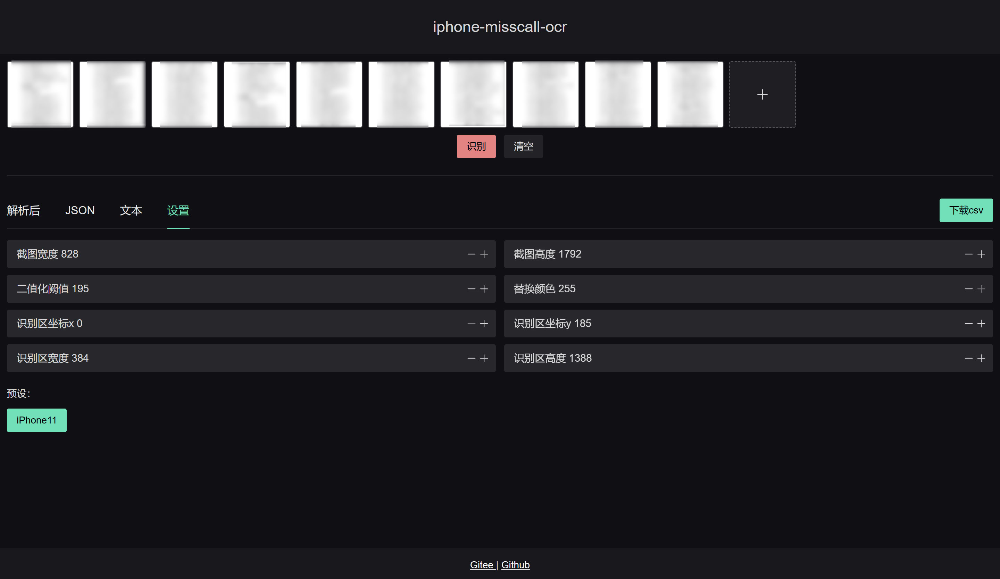

# iphone-misscall-ocr

iphone 未接来电截图转文字，并提供json和csv格式下载，使用 tesseract.js,和opencv.js实现识别功能。

通过调整参数可以识别更多型号的ios设备截图，预设参数适用iPhone11

## 图片预处理流程

原始图片 => 调整大小 => 截取识别区域 => 转换为灰度图像 => 二值化 => 生成base64 => 识别文字

## 预览地址

[https://acccccccb.github.io/iphone-misscall-ocr/](https://acccccccb.github.io/iphone-misscall-ocr/)

## 运行

```npm run dev```

## 打包

```npm run build```

## 截图




## 识别区域

电话号码和归属地需要成对出现

