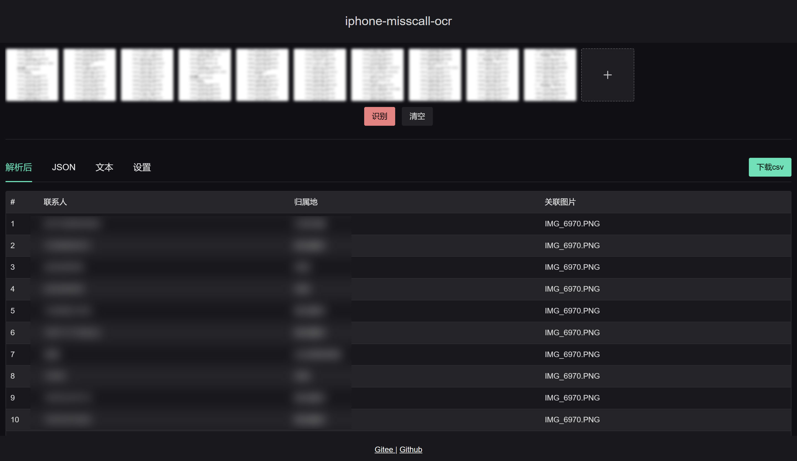

# iphone-misscall-ocr

iphone 未接来电截图转文字，并提供csv格式下载，使用 tesseract.js,和opencv.js实现识别功能，目前只在iPhone11机型测试过。

## 预览地址

[https://acccccccb.github.io/iphone-misscall-ocr/](https://acccccccb.github.io/iphone-misscall-ocr/)

## 运行

```npm run dev```

## 截图



## 识别区域

电话号码和归属地需要成对出现

